# Chess
My wonderful java chess game

A chess project created in java, including features of complete chess rule, recording, undoing and multiplayer.
This project is developed with MVC principle. It has separate model and view, so you would be welcome to create your own java view frame and still using our model easily. All public methods are well explained and decumented.
Be careful when you trying to make some changes inside model, you can easily break something. However, feel free to contact the author at <a href = "mailto:fredzqm@gmail.com">fredzqm@gmail.com</a> with bugs you found.

<h2>To start</h2>
To run this project, you can create a new java project in eclipse, copy files in the root folder into the project folder and others into the src folder.
Simply run the Main to start the game, and then you see two windows. One for the white view the other for the black view.
You can use those codes to create online chess gaming with multiple people viewing it.
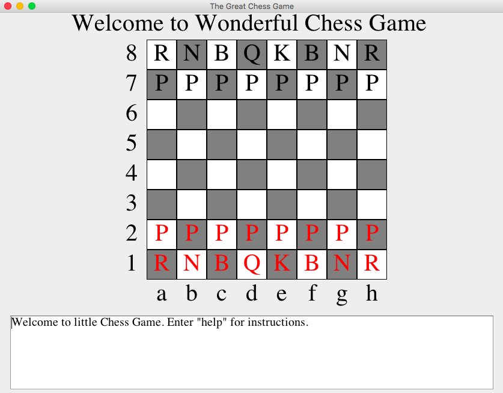

<h2>Make a move</h2>
To make a move in the game, you can either click in the panel or type a command in the standard chess recording format in the console. 
The UI ability makes it vey easy for user to make move.
If you want to use this software as an library, it would be easier to send instructions via command line.

<h3>Use command line to make a move</h3>
It is very convenience to use command line input by simply typing chess moves like `e2-e4`, `Ng1-f3`. You can also type abbreviation like e4，Nf3. If you only mention the end square and kind of piece, our smart chess model will search the whole board and find the ove you mean. It can happen once in a while, when there are multiply possibilites or none of them. In those situations, you will see a message indicating that there is ambiguity, and you need to be more specific.
In general, it would be recommend to use the complete command if you are using it as a library, since it will take less time for the model to process.

As shown in the example, black f6 knight is attacking white e4 pawn, so white can just type `Nc3` and `Enter` to protect its pawn.

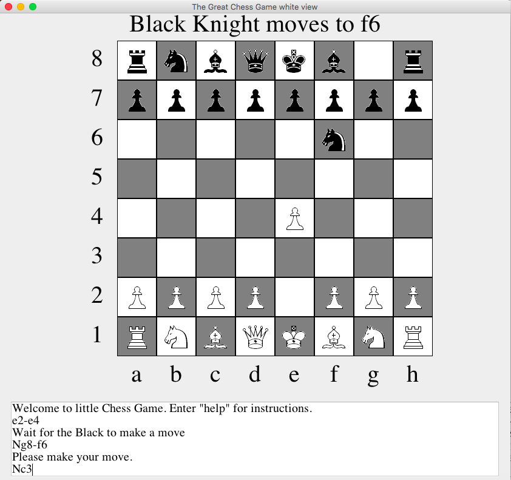

<h3>Use Graphical user interface (GUI) to make a move</h3>
It is very easy to play the two-people game with our GUI system. You can just click on the piece you want to move, and all the possible square it can go will be hightlighted, then you can just click to make that move. As indicated by the rule of chess, your move can't give away your king. Our model is smart enought to detect and hide those illegal moves.
In the following example, queen cannot leave e file since rook is attacking the queen.
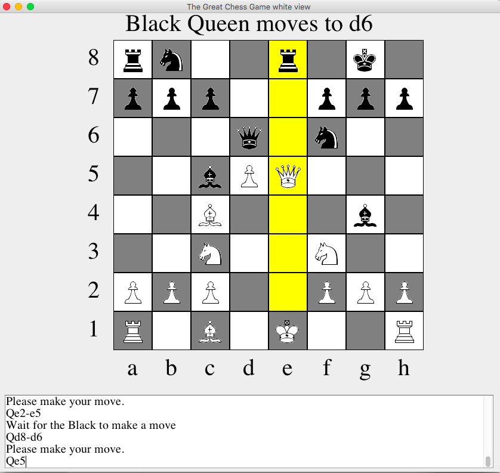
In this example, there are only two spots queen can go to protected the attack of black rook.
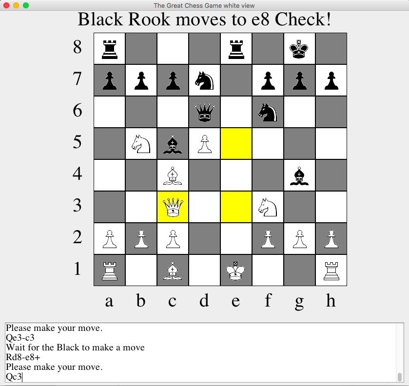
Queen can move to lots of squares in the next move.
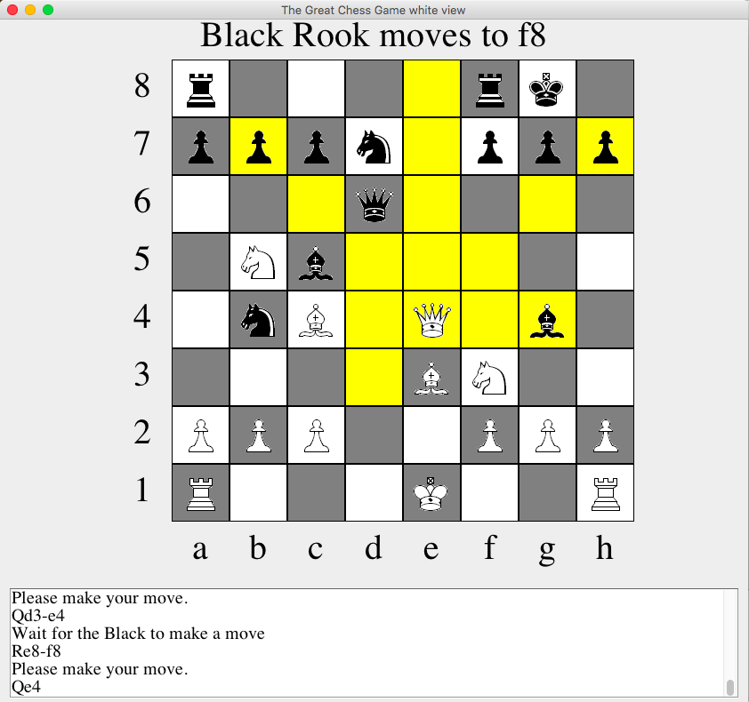

<h2>Detect the end of game</h2>
After each move, the program will check the situation on the board and indicate if the game has reached an end.

<h3>Checkmate</h3>
When one player makes a checkmate -- The opponent is being checked and all moves it has will give its king away.
The game will be automatically ended and messages will be sent.
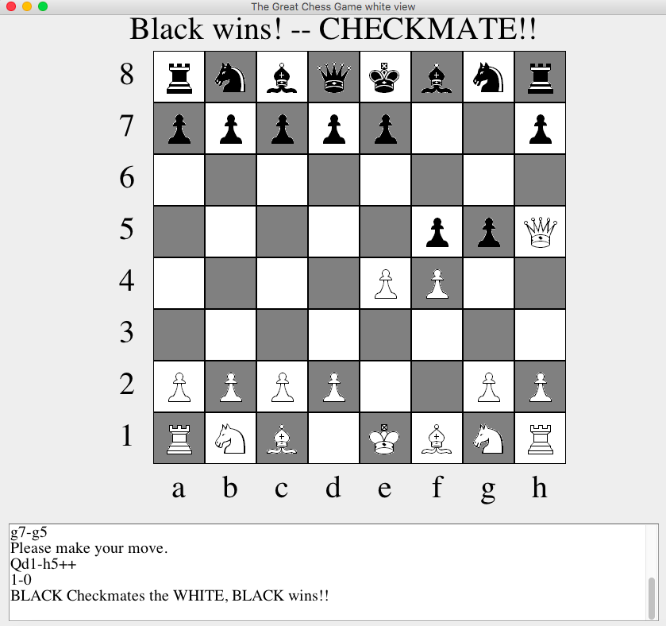

<h3>Resign</h3>
If one player sees little chance of winning or drawing, he can type `resign` in the commad line. The game will be ended immediately.
If the program decides that the game has already satisfied conditions for automatic draw, it will declare a draw instead of resign.
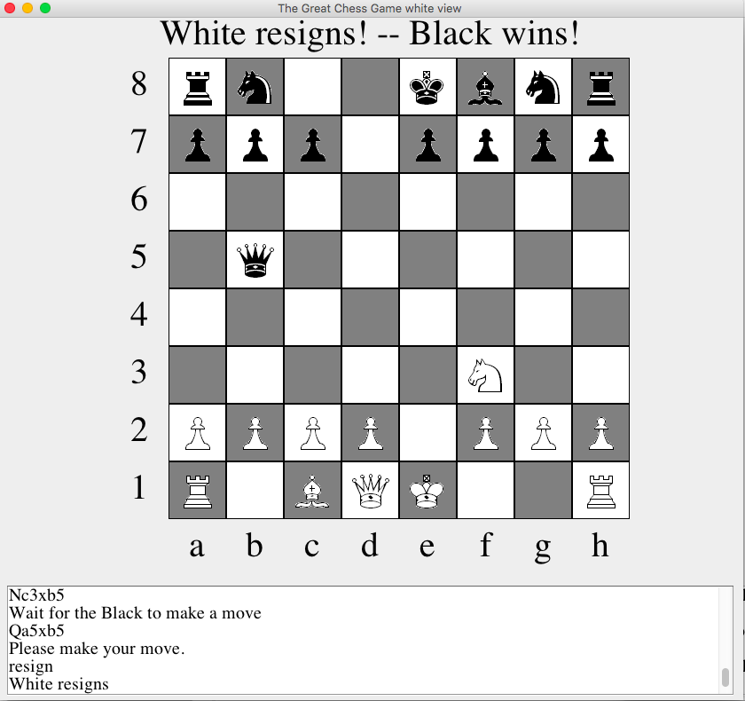

<h3>Stalemate</h3>
When one player makes a stalemate -- The opponent is not being checked and all moves it has will give its king away.
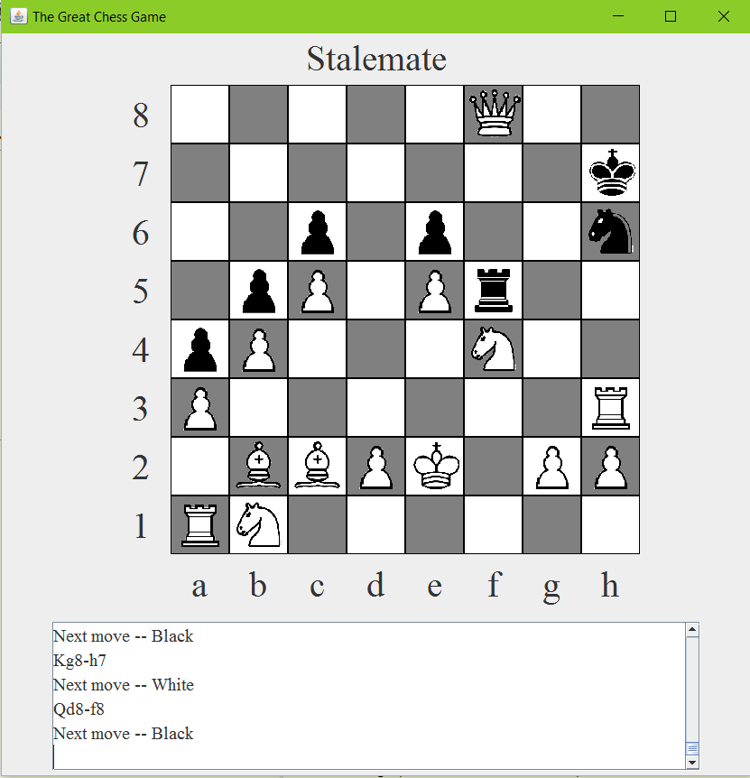

<h3>Draw by agreement</h3>
If one player gets tired of playing and think neither sides have a chance of making checkmate, he or she can request an draw by type `darw` in the command console. If the program decides that the game has already satisfied conditions for automatic draw, it will declare draw immediately, otherwise it will send a request to his opponent for response, who can either type `yes` or `no` to accept or decline the draw request. One player cannot request for draw consecutively according to rules of chess. 

<h3>Draw by threefold repetition</h3>
When the same pattern of moves occurs at least 3 times, the game satisfies automatic draw condition due to "Threefold Repetition". If either player request `draw`, the game will be ended automatically.

<h3>Draw by fifty-move rule</h3>
If there has been no capture or pawn move in the last fifty moves by each player, the games satisfies automatic draw condition due to "Fifty-move rule". If either player request `draw`, the game will be ended automatically.

<!--
-->
<!--The game is immediately drawn when there is no possibility of checkmate for either side with any series of legal moves. This draw is often due to insufficient material, including the endgames-->
<!--king against king;-->
<!--king against king and bishop;-->
<!--king against king and knight;-->
<!--king and bishop against king and bishop, with both bishops on squares of the same color (see Checkmate#Unusual mates).[17]-->
<!--
-->

<h1>Special Moves of chess</h1>
There are many special moves in chess like castling, En passant and promotion, which would require additional attention and harder to implements.
This program can determe whether castling or En Passant is legal.

<h3>Castling</h3>
Castling is a very useful move to protect king and ultilized rook. However, there are many constrains.
<ul>
<li>The king and rook involved in castling must not have previously moved</li>
<li>There must be no pieces between the king and the rook</li>
<li>The king may not currently be in check, nor may the king pass through or end up in a square that is under attack by an enemy piece (though the rook is permitted to be under attack and to pass over an attacked square)</li>
</ul>
Our program is able to check all of those constrains to determin whether a castling is legal.
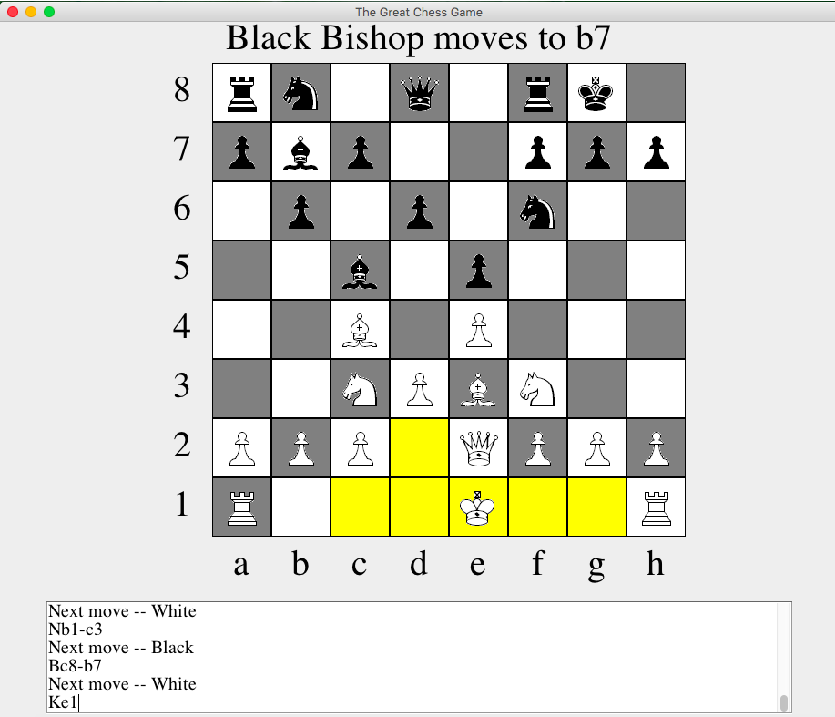

<h3>En Passant</h1>
When a pawn advances two squares from its original square and ends the turn adjacent to a pawn of the opponent's on the same rank, it may be captured by that pawn of the opponent's, as if it had moved only one square forward. This capture is only legal on the opponent's next move immediately following the first pawn's advance.
<a href='http://www.wiki.com/en/En_passant'>See Wikipedia</a>
Here is an example of en passant. Black just advanced g7 pawn two squares, so white can take en passant pawn immediately.
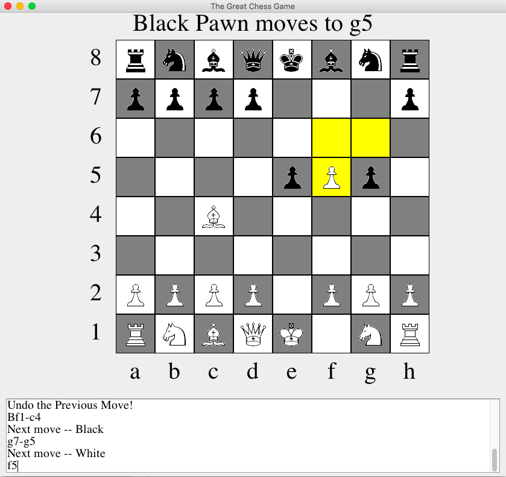

<h1>Record Features</h1>
<h3>print out records</h3>
This program has a helpful ability to record the game. You can type `print` to print out the records of the game you just played.
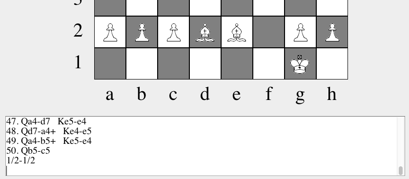

<h3>Undo</h3>
You can undo a previous step by typing `undo` in the command window.
Even en passant and castling or promotion can be easily undoed.

If you find a game interesting, you can also get the full records of the game by typing 'print' and a standard formated chess records would be printed in the console.a
To restart a game, you can type 'restart' in the console.

If you have any questions or suggestion, you can contact me at fredzqm@gmail.com
